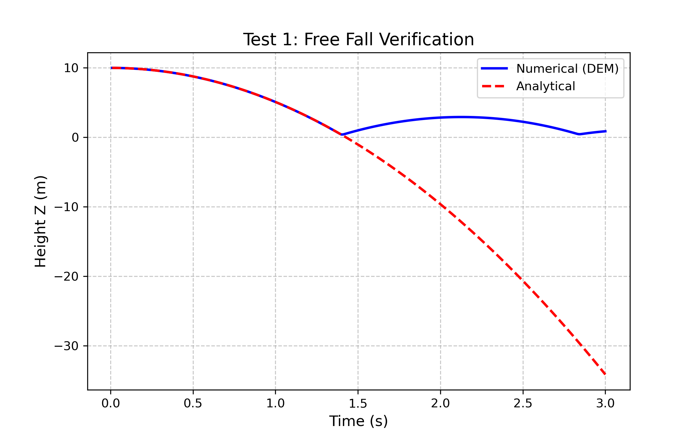
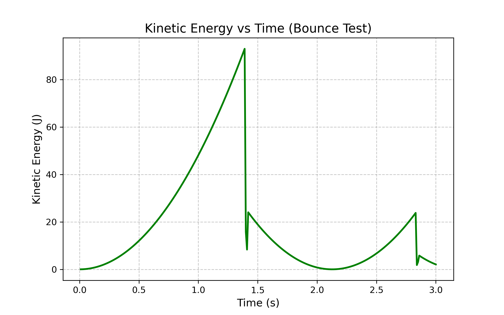
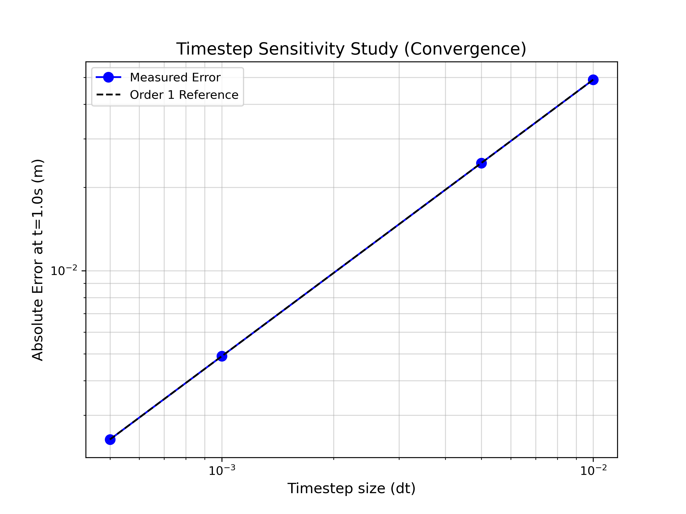
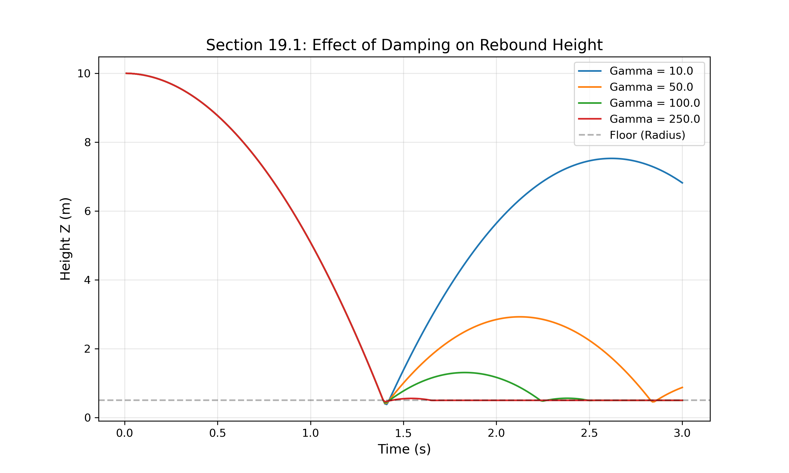

# Parallel DEM Simulator (HPSC Assignment 1)
**Author:** Vishal (IIT Mandi)

## Features
- **Physics:** 3D Discrete Element Method with Spring-Dashpot contact laws.
- **Parallelization:** OpenMP multi-threading (Scales up to 12+ threads).
- **Optimization:** $O(N)$ Neighbor Search using Cell-Linked Lists.
- **Verification:** Analytical comparison for Free Fall and Kinetic Energy decay.

## Simulation Results

### 1. Free Fall Verification
Comparison between numerical DEM results and the analytical solution.

### 2. Energy Dissipation
Demonstration of the Spring-Dashpot damping effect.

### 3. Scientific Studies
Timestep sensitivity (Convergence) and Damping effect analysis.

